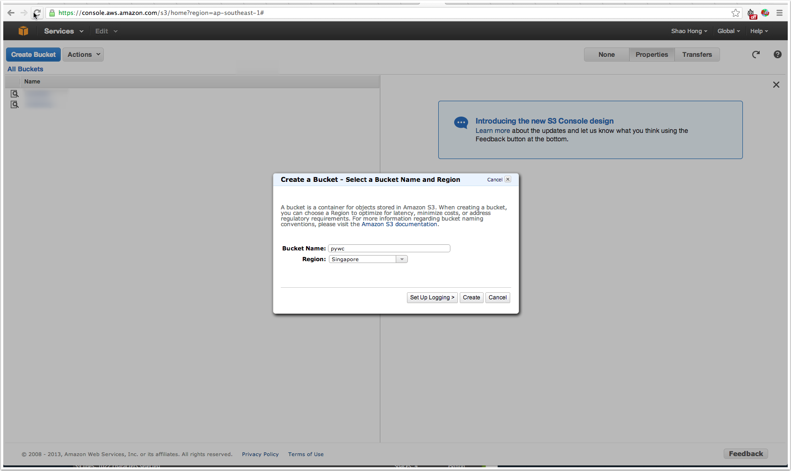

# Sample Wordcount Streaming Job on Commoncrawl Dataset using Python

This is inspire from miso's [article](http://www.fightswithbytes.com/2013/04/05/sample-wordcount-streaming-job-using-php-on-commoncrawl-dataset/) using php on Commoncrawl's dataset.

Just like any Mapreduce job, this contain's mapper.py and reducer.py script.

### mapper.py

	#!/user/bin/python
	
	import sys
	
	# input comes from STDIN (standard input)
	for line in sys.stdin:
    	# remove leading and trailing whitespace
    	line = line.strip()
    	
    	# split the line into words
    	words = line.split()
    	
    	# increase counters
    	for word in words:
    	
	        # write the results to STDOUT (standard output);
	        # what we output here will be the input for the
	        # Reduce step, i.e. the input for reducer.py
	        #
	        # tab-delimited; the trivial word count is 1
	        print '%s\t%s' % (word, 1)
        
### reducer.py

	#!/usr/bin/python

	from operator import itemgetter
	import sys

	current_word = None
	current_count = 0
	word = None

	# input comes from STDIN
	for line in sys.stdin:

	    # remove leading and trailing whitespace
	    line = line.strip()

	    # parse the input we got from mapper.py
	    word, count = line.split('\t', 1)

	    # convert count (currently a string) to int
	    try:
	        count = int(count)
	    except ValueError:
	        # count was not a number, so silently
	        # ignore/discard this line
	        continue

	    # this IF-switch only works because Hadoop sorts map output
	    # by key (here: word) before it is passed to the reducer
	    if current_word == word:
	        current_count += count
	    else:
	        if current_word:
	            # write result to STDOUT
	            print '%s\t%s' % (current_word, current_count)
	        current_count = count
	        current_word = word

	# do not forget to output the last word if needed!
	if current_word == word:
	    print '%s\t%s' % (current_word, current_count)
	    
* Next upload this to Amazon S3 bucket by creating a folder call something like "pywc" and upload both mapper.py and reducer.py:

* Then launch Amazon's Elastic MapReduce and create a new job, select "Run your own application", "Streaming" and click "Continue":

* On the next page, for "Input Location" put `aws-publicdatasets/common-crawl/parse-output/segment/1341690169105/textData-00112` and for "Output Location", "Mapper" and "Reducer", you have to point to your S3 bucket which is "pywc/[filename]". Lastly for "Extra Args", you will enter `-inputformat SequenceFileAsTextInputFormat` which tell the job the format is the inputfile stored in so it can read.

* Next, you select the type and number of Instances to run for your job.

* On the "Adcanced Options" page, you should enable debugging, so that you can track the log if there is any error. You can can store your Logs into your S3 bucket.

* On the next page, select "Proceed with no Bootstrap Actions"

* Finally on the review page, double check every and create a job flow!

The whole process takes about 20 minture and you can see the status from the main console page. After it done, you can "collect" from your S3 bucket.

Please feel free to contact me if there is any error! :)

